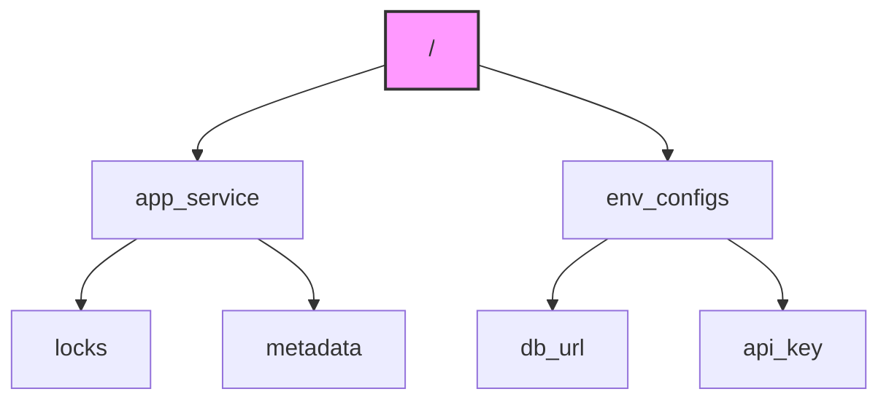
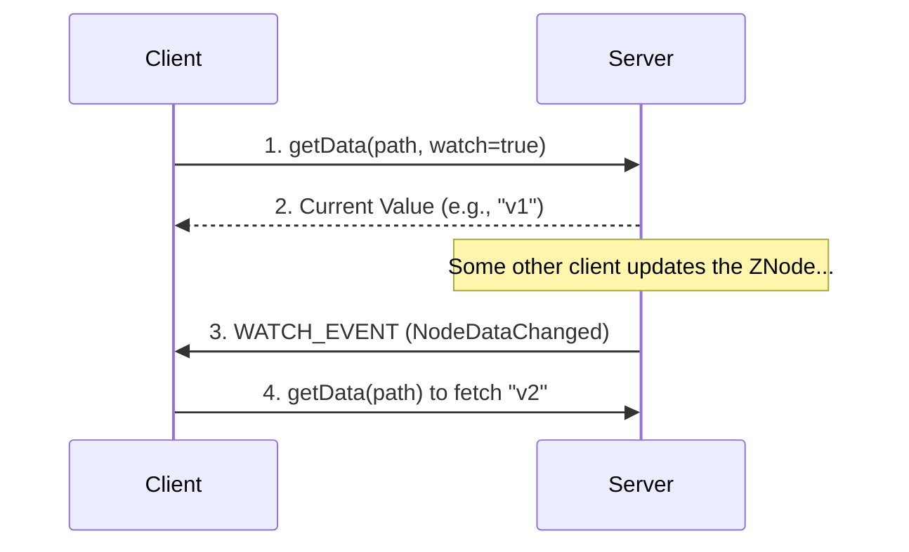
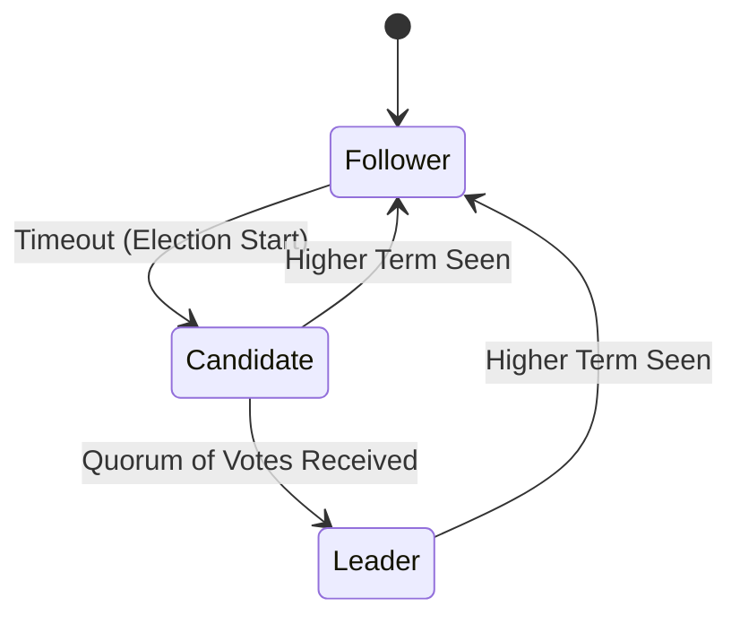
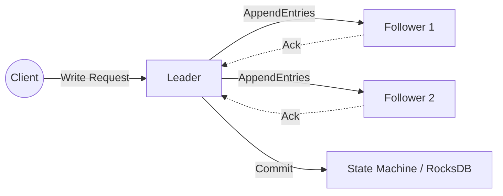
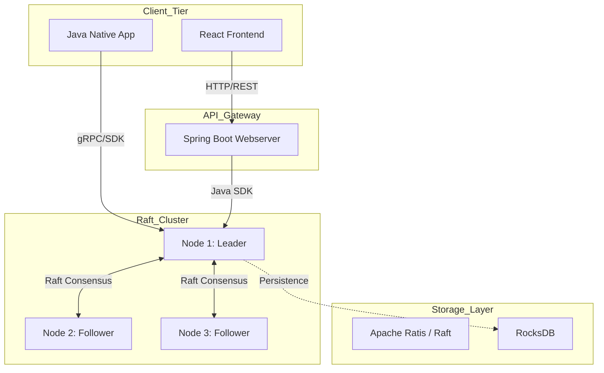

# 🏛️ Zookeeper-Clone

[](https://www.oracle.com/java/)
[](https://spring.io/projects/spring-boot)
[](https://reactjs.org/)
[](https://www.docker.com/)
[](LICENSE)

> **A high-performance, distributed coordination service clone modeled after Apache ZooKeeper.** 

This project is a from-scratch implementation of a distributed hierarchical key-value store, providing strong consistency through the **Raft Consensus Algorithm** and persistent storage via **RocksDB**. It includes a full-featured Java SDK, a Spring Boot REST API layer with RBAC security, and a React-based management dashboard.

---

## 🎓 The Fundamentals

Developing distributed systems requires solving the **Coordination Problem**—ensuring that multiple independent nodes can agree on a shared state even when individual nodes or networks fail.

### 1. What is ZooKeeper?
Apache ZooKeeper is a **Distributed Coordination Service** that provides a simple set of primitives to implement higher-level synchronization services like leader election, configuration management, and distributed locks.

#### 📂 The ZNode Data Model
Unlike a flat database, ZooKeeper stores data in a **hierarchical tree structure** (similar to a filesystem), where each node is called a **ZNode**.



#### 🔔 The Watcher Mechanism
One of ZooKeeper’s most powerful features is the ability for clients to set **Watches** on ZNodes. This allows for event-driven architectures where clients are notified immediately of changes, rather than polling the server.



---

### 2. What is Raft?
In a distributed cluster, we cannot rely on a single node. Instead, we use a **Consensus Algorithm** like **Raft** to ensure all nodes in the cluster eventually agree on the same sequence of operations (the Log).

#### 🗳️ Leader Election
Raft nodes are always in one of three states. The **Leader** handles all client requests, while **Followers** replicate the Leader's log.



#### 📜 Log Replication
When you write data, the Leader appends the change to its log and sends it to all Followers. Once a majority (**Quorum**) of nodes have persisted the entry, it is considered **Committed**.



---

## 🏗️ Architecture Overview

The system is designed with a modular architecture to ensure scalability and separation of concerns.



---

## 🚀 Features

### 📡 Distributed Core
*   **Strong Consistency**: Linearizable reads/writes via Raft consensus (Apache Ratis).
*   **Persistent Storage**: High-performance key-value persistence using RocksDB JNI.
*   **Hierarchical Namespace**: ZNode-style tree structure supporting recursive directory creation.
*   **Ephemeral Nodes**: Automatic node cleanup upon client session expiration.
*   **Real-time Watchers**: Support for `PUT_EVENT` and `DELETE_EVENT` notifications.

### 🔐 Security & Management (RBAC)
*   **Fine-grained Permissions**: 
    - `isAdmin`: Full access to cluster metrics and global user management.
    - `canCreateDirectory`: Permission to create new hierarchical branches.
    - **Directory-specific ACLs**: Control access at any level of the ZNode tree.
*   **OAuth2 & JWT**: Secure authentication with Google OAuth integration.
*   **Cluster Observability**: Real-time tracking of election counts, append latencies, and request throughput.

---

## 🛠️ Getting Started

### Prerequisites
- **Java 17+** & **Maven 3.8+**
- **Node.js 18+** & **npm**
- **Docker** & **Docker Compose**

### 1. Start the Zookeeper Cluster
Spin up a 5-node distributed cluster using Docker:
```bash
cd zookeeper
mvn clean package -DskipTests
docker-compose up -d
```

### 2. Start the Backend (API Gateway)
The Spring Boot server acts as a gateway between the cluster and the Web UI.
```bash
cd zookeeper-webserver
mvn spring-boot:run
```
*   **Port**: `8080` (API), `http://localhost:8080/swagger-ui.html` (Documentation)

### 3. Start the Frontend (Dashboard)
The React dashboard provides a visual interface for the ZNode tree.
```bash
cd frontend
npm install
npm start
```
*   **Port**: `3000` (Access at `http://localhost:3000`)

---

## 📦 Using as a Dependency

To use the Zookeeper client library in your own Java projects, follow these steps:

### 1. Install to Local Maven Repo
From the root of the project, navigate to the client module and install:
```bash
cd client
mvn clean install -DskipTests
```

### 2. Add to your `pom.xml`
```xml
<dependency>
    <groupId>client.zookeeper</groupId>
    <artifactId>zookeeper</artifactId>
    <version>1.0-SNAPSHOT</version>
</dependency>
```

### 3. Basic SDK Usage
```java
// Build the client pointing to cluster peers
ZookeeperClient client = new ZookeeperClient(raftClient, event -> {
    System.out.println("Global Event: " + event.getType());
});

// Authenticate and perform operations
client.login("user@example.com", "password");
client.create("/config/app", "{\"timeout\": 5000}", false);

// Asynchronous Watchers
client.addWatch("/config/app", (event) -> {
    System.out.println("Config changed! Type: " + event.getEventType());
});
```

---

## 🛡️ Resilience & Distributed Safety

A production-grade distributed system must expect failure. This implementation is engineered with several safety-critical features:

*   **Log Compaction & Snapshots**: To prevent the Raft log from growing indefinitely, the system utilizes **RocksDB snapshots**. Periodically, the current state machine state is persisted, allowing the Raft log to be safely truncated, saving significant disk space and reducing recovery time.
*   **Failover & Re-election**: Leveraging **Apache Ratis**, the cluster automatically detects Leader failure. Followers will initiate a new election term within milliseconds, ensuring near-continuous availability.
*   **Quorum-Based Durability**: The system strictly enforces the **Quorum Rule** ($N/2+1$). No write is ever acknowledged to the client until it has been safely persisted on a majority of nodes, guaranteeing zero data loss during network partitions.

---

## 🧪 Engineering Rigor (Testing)

Reliability in distributed systems is achieved through exhaustive testing. This project emphasizes a deterministic testing strategy:

*   **State Machine Verification**: The `KVStateMachine` (the core logic) is verified using **JUnit 5** and **Mockito**. We simulate complex distributed scenarios, such as SSL/Transport failures and malformed RPC packets, to ensure the state machine remains robust.
*   **Conflict Resolution**: Automated tests verify that during a partition, nodes correctly reject stale logs from a lower term and synchronize with the authoritative Leader once connectivity is restored.

---

## 🗺️ Future Roadmap

This project is under active evolution with the following architectural goals:

- [ ] **Multi-Raft Support**: Implementing multiple independent Raft groups (sharding) to scale out write throughput horizontally.
- [ ] **Dynamic Membership**: Enabling `AddNode` / `RemoveNode` operations without requiring a full cluster restart.
- [ ] **Chaos Engineering Integration**: Creating a suite of "Chaos Monkey" scripts to randomly inject latencies and kill processes to verify real-world stability.

---

## 📝 Configuration

### Node Environment Variables
| Variable | Default | Description |
| :--- | :--- | :--- |
| `NODE_ID` | (Required) | Unique identifier for the node (n1, n2, etc.) |
| `PORT` | 6000 | Port for gRPC/Raft communication |
| `CLUSTER` | (Required) | List of peers: `id1:host1:port1,id2:host2:port2...` |
| `DB_PATH` | `/RocksDB` | Absolute path for data persistence |
| `SNAPSHOT_THRESHOLD` | 1000 | Number of log entries before snapshotting |

---

## ⚖️ License

Distributed under the Apache License 2.0. See `LICENSE` for more information.

---

## 🤝 Acknowledgements
Inspired by the architecture of **Apache ZooKeeper** and the **Raft Research Paper**. Special thanks to the **Apache Ratis** community for providing a robust Raft implementation for the JVM.
